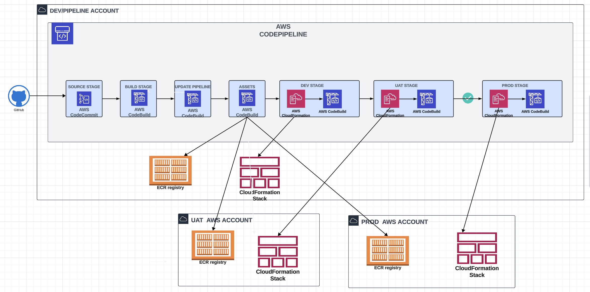
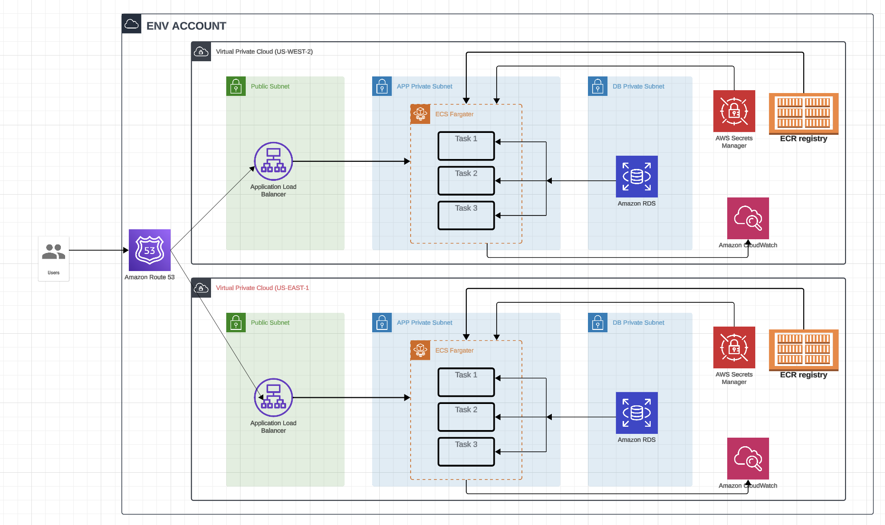

# Welcome to CDK TypeScript project by obiorah for BMO

## Codepipeline Architecture

## 3-tier Architecture

## Pre-requisite for set up
1. Install AWS CLI
2. Have an AWS Account
3. Install Nodejs (16)
4. Install TypeScript 3.8 or later `npm -g install typescript`
5. Install AWS CDK CLI `npm install -g aws-cdk`
6. Configure AWS security credentials for the CDK CLI.

## Usage
1. Clone this repository
2. Modify `cdk.context.json` with your environments and account details on stage. You can remove or add more stages.
3. Ensure AWS security credential is configured
4. Boostrap all accounts provided in step 2, simply by running the boostrap.sh script `sh bootstrap.sh`. [One time setup]
5. Deploy cdk codepipeline. Run `npx cdk deploy ObiCdkStack`. [One time setup]
6. Go into the dev AWS account to confirm that the pipeline has been created.
7. Modify/Update your environment/AWS account variables in the file `constants/constants.ts`
7. Modify or add new stacks/stages to the pipeline in the folder `lib/`

This is a blank project for CDK development with TypeScript.

The `cdk.json` file tells the CDK Toolkit how to execute your app.

## Useful commands

* `npm run build`   compile typescript to js
* `npm run watch`   watch for changes and compile
* `npm run test`    perform the jest unit tests
* `npx cdk deploy`  deploy this stack to your default AWS account/region
* `npx cdk diff`    compare deployed stack with current state
* `npx cdk synth`   emits the synthesized CloudFormation template

